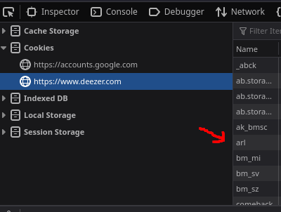

# dzr-cli

## Prerequisites

This project uses mpv to reproduce all media, then you need to either install [mpv](https://mpv.io) itself or any of their libs:

- mpv-libs
- mpv-devel

## Running the app

You can run the app using the following command:

```sh
./dzr
```

> **Note:** downloading the files require to have your `arl` at `.config/deemix/.arl`.

To get your `arl`, login into your [Deezer](https://deezer.com) account, open `developer tools` and check for the cached values:



## Reference:
Downloader code taken from https://raw.githubusercontent.com/naujzed/deempy/main/dmx.py